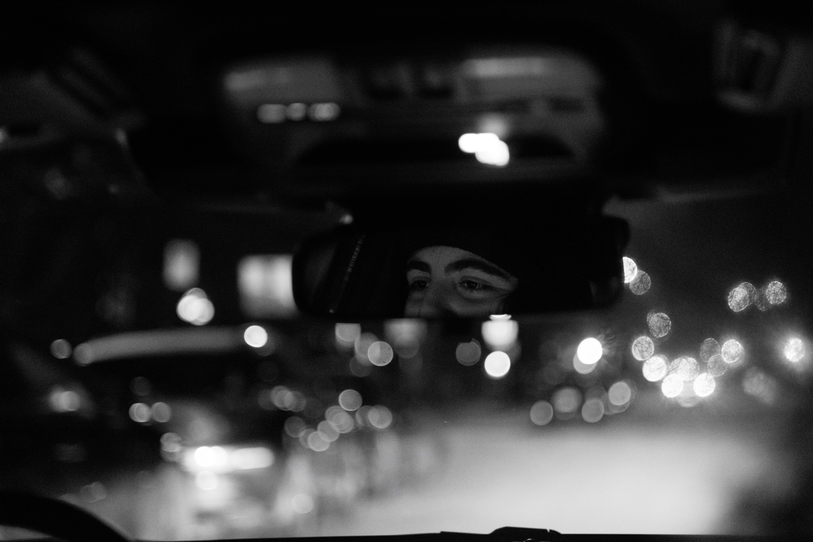
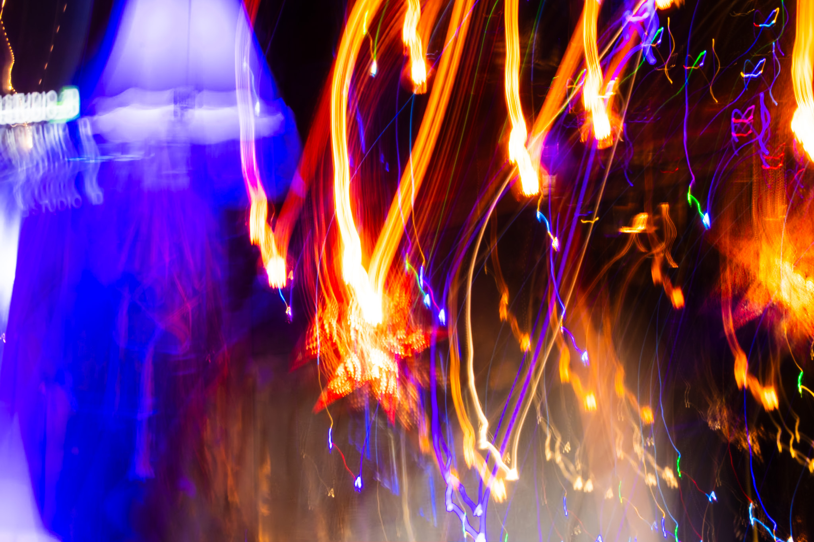

OpenGL's default camera has a few limitations for would-be virtual photographers. 
For one, everything in a rendered frame would be in focus.
<!-- Expand -->
Depth of field, defined as "the distance between the nearest and the furthest objects that are in acceptably sharp focus in an image captured with a camera" [@ContributorsWikimedia2023], allows for separation of subject and background, enabling clearer compositions (see @fig:lea). Notice also the light spheres present in @fig:lea and @fig:rev. 
That is bokeh, an effect resulting from how lenses and focusing works that cannot be achieved by applying a simple blurring filter on the background layer.
For two, the images are perfectly still. There is no motion blur by default. Conveying a sense of motion in a single frame, as well as creative techniques such as light painting (see @fig:lightpainting) and intentional camera movement (ICM) (see @fig:icm), are thus impossible. 

{#fig:lightpainting}

{#fig:lea}

{#fig:rev}

<!-- {#fig:flowers} -->

Examples of DoF (Taken by the author)

Examples of long exposure photography. (Taken by the Author)

<!-- [@Lee2009] -->

\pagebreak

# Goals

The following is a list of key features I'm aiming to implement.

- Saving an image
- Depth of field
  - Bokeh
  - Focusing
- Motion Blur
  - Light Painting
  - ICM
- Variable Light Sensitivity (ISO)
- User Interface

While the goal of the project is to create a "realistic" camera simulator, features will be tweaked to favour aesthetics should the "realistic" option be visually unappealing.

## Stretch Goals

> As they say, overpromise and underdeliver. 

These are the features that, time permitting, I would like to implement, but are not a priority.

- Autofocus
- Video export

# Road Map

This section will go into the technical details and potential issues uncovered during preliminary research. 

## Pretty rendering

The first step of this process is to get scenes to render well with the default camera. 
Basically, get OpenGL to do what it's good at.

## Saving an image

The second obvious step is transforming the rendered scene into an image of some kind.
My goal would be to output `jpg`s, as they are the standard in photography. During initial development, the plan is to use whatever OpenGL can save with the fewest complications (probably along the lines of the answers in [@SurvivalMachine2019], @Lencerf2023's blog post), so that the feature can be out of the way for further development.  

## Exposure

By default, OpenGL should "expose correctly," in that any rendered scene should be adequately lit.
ISO, which for the purposes of this project is a basic sensitivity scale, would adjust the brightness of the rendered scene.

### Compositing 

One idea for achieving motion blur, light painting, and potentially intentional camera movement is frame compositing.

It would look something like this

$$\text{Image} = \sum^n_0 ({\text{frame}_n} \times ISO \times \Delta T \times \gamma)$$

where:

\begin{align*}
\text{frame}_n &: n\text{'th frame}\\
ISO&: \text{ISO (user's way of changing sensitivity)} \\
\Delta T &: \text{time to render frame}\\
\gamma&: \text{adjusts brightness of the scene based on how long it took to render}
\end{align*}

The first milestone for this part of the project would be having exposure duration (shutter speed) influence the brightness of the exported image. The second would be to save frames to a buffer as they render, then merging those buffers together using compositing techniques. 

### Alternative motion blur options

Alternative motion blur techniques will also be explored, the one that generates the nicest looking frames with moving lights and moving cameras will be chosen. The above section simply describes on brain-stormed idea.

## Loading an environment

The previous steps should be achievable with very simple environments (like, say, a moving triangle).
The next steps need more complex environments to be loaded in. Thus, the next step would be loading in environments from files, ensuring that the rendering works.

Would I be allowed to load copyright free 3D environments obtained online, or would I need to create them myself?

A sub-goal would be loading a virtual avatar into an environment and being able to render "photographs" of said avatar, or render a video (stretch goal, if time permits).

## Depth of Field

Depth of field refers to the area within an image that is in focus. A lot of depth of field is achieved with a very small aperture, which is means a larger f-number. An aperture of f/8 will have a smaller aperture opening than one of f/1.8, resulting in more of the image being in focus (for the purposes of this project we will accept this nomenclature).

I was able to find @Yu2004's paper on simulating depth of field in OpenGL. I intend to adapt their methods and combine them with @Lettier2021's dilation technique (if it is aesthetically pleasing). Other resources I've encountered are @Lettier2021a and @ContributorsWikimedia2020.

## Zoom

Zoom should be relatively simple. Perspective matrix, bam you're done.

### Fisheye effect

> Taking wide angle zooming to the logical extreme.

This may prove a bit more complicated. I consider this a stretch goal. Not every photographer owns, needs, or even wants a fisheye, but they are undeniably cool.

![Fisheye Lens. Source: [@Stuefer2005]](Fisheye_photo.jpg){#fig:fisheye}

<!-- Image -->

> And then push it even further.

I'm not even sure this is doable. Will be explored should I have a massive excess of time.

<!-- Image of 360 camera -->
![Alt 360 Camera. Source: [@StAmant2010]](1024px-197_-_Buenos_Aires_-_Plaza_de_la_Republica_-_Janvier_2010-1.jpg){#fig:360CAM}

## Autofocus

Display a crosshair on the screen. Whenever the focus button is pressed, calculate the distance from the camera to the geometry intersecting the crosshair and assign that value to the focus distance.